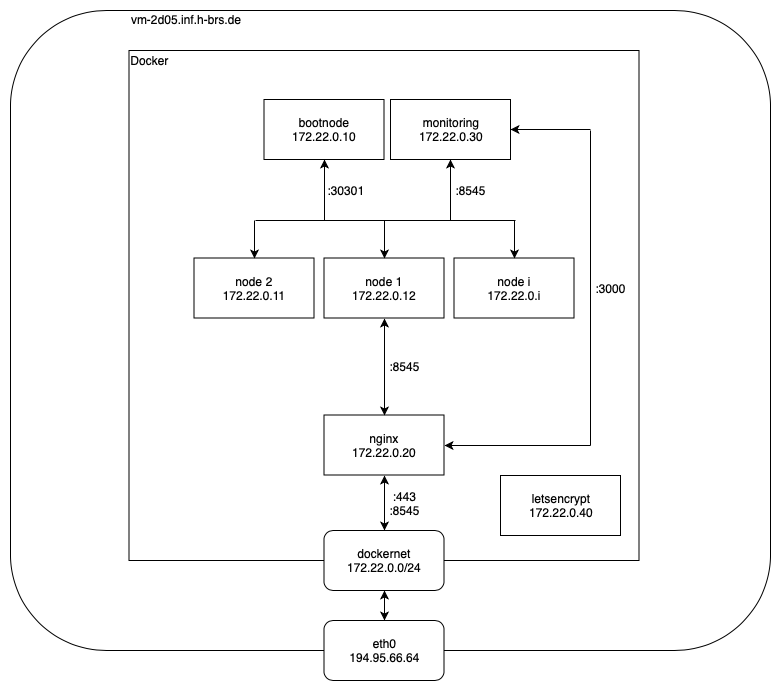

# master_thesis
All files which belong to my master thesis.

## Content

- [01 - Setup blockchain](./documentation/01_setup_blockchain.md)
- [02 - Clean blockchain / all](./documentation/02_clean_blockchain.md)
- [03 - Run blockchainl](./documentation/03_run_blockchain.md)
- [04 - Setup monitoringl](./documentation/04_setup_monitoring.md)
	- [04.1 - Nginx config](./documentation/04_1_nginx_conf.md)
- [05 - Truffle](./documentation/05_truffle.md)

## Network plan

